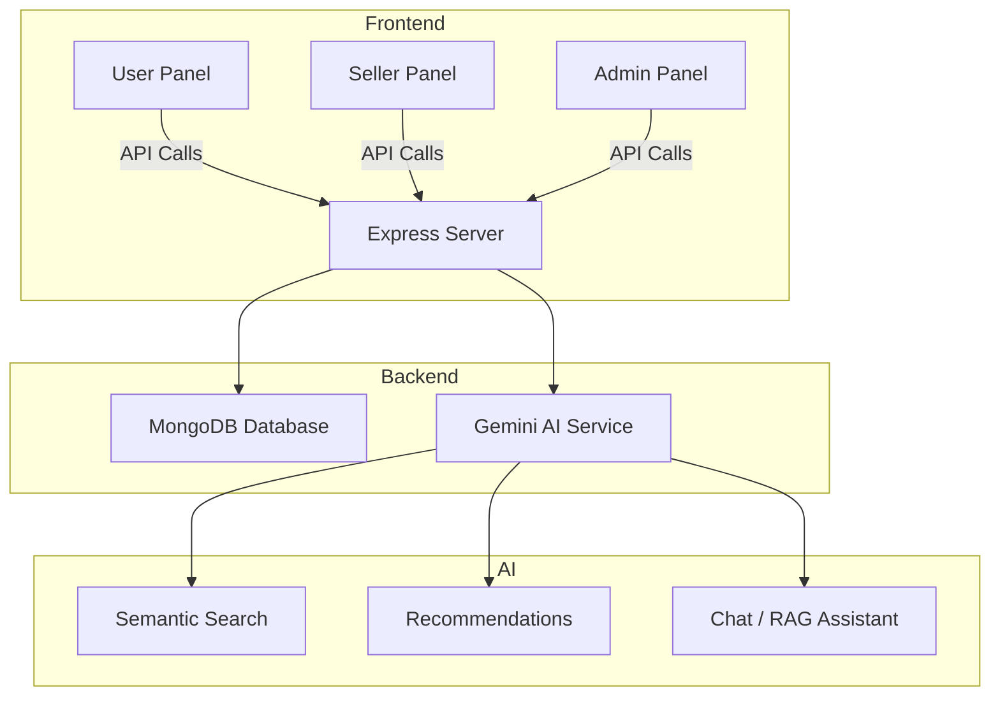

<h1 align="center">
  ecom-ai · MERN Commerce <span style="color:orange">× AI</span> 🛍️🤖
</h1>

<p align="center">
User | Seller | Admin + Gemini-powered AI
</p>

<!-- <p align="center">
  <a href="https://nodejs.org/">
    
  </a>&nbsp;&nbsp;
  <a href="https://opensource.org/licenses/MIT">
    
  </a>&nbsp;&nbsp;
  <a href="https://github.com/Sarthak_Aloria/ecom-ai/graphs/contributors">
    
  </a>&nbsp;&nbsp;
  <a href="https://www.npmjs.com/">
    
  </a>&nbsp;&nbsp;
  <a href="https://react.dev/">
    
  </a>&nbsp;&nbsp;
  &nbsp;&nbsp;
  
</p> -->

<p align="center">
  <a href="https://nodejs.org/">
    
  </a>&nbsp;&nbsp;
  <a href="https://www.npmjs.com/">
    
  </a>&nbsp;&nbsp;
  <a href="https://react.dev/">
    
  </a>&nbsp;&nbsp;
  &nbsp;&nbsp;
  <a href="https://github.com/SarthakAloria/ecom-ai/graphs/contributors">
    
  </a>
</p>

---

A full-stack MERN ecommerce starter with **User, Seller, and Admin panels**, featuring **AI-powered assistance** for search, recommendations, and chat/RAG helpers. Designed for **team collaboration, demos, and learning** — production-minded but chill.

> **Status:** alpha — basic flows done (server scaffold, auth skeleton, product model). More features incoming. PRs welcome.

---

## 📚 Table of Contents

- [🚀 About](#-about)
- [✨ Features](#-features)
- [📦 Tech Stack](#-tech-stack)
- [🏗️ Architecture](#%EF%B8%8F-project-architecture-mermaid) 
- [⚙️ Setup & Run](#%EF%B8%8F-setup--run)
- [👩‍💻 Authors](#%E2%80%8D-authors)

---

## 🚀 About

**ecom-ai** is a starter MERN ecommerce project built for a college minor project.  
It includes **User, Seller, and Admin panels**, along with a basic AI-assisted scaffold for features like semantic search and recommendations.  

Designed for **team collaboration** and learning, this repo serves as the foundation for expanding into a full-featured ecommerce platform.

---

## ✨ Features

- Multi-role system scaffold: **User**, **Seller**, **Admin**  
- MERN stack setup: Node.js + Express + MongoDB  
- Folder structure ready for backend, frontend, and AI features  
- Ready for team collaboration and further development

---

## 📦 Tech Stack

- **Frontend:** React (planned / future)  
- **Backend:** Node.js + Express  
- **Database:** MongoDB (via Mongoose)  
- **Authentication:** JWT (planned)  
- **AI / Assistant:** Gemini AI (planned integration for semantic search, recommendations, and RAG-style helpers)  
- **Dev Tools:** ESLint, Prettier, Git
---

## 🏗️ Project Architecture (Mermaid)


### Notes:
- **Frontend**: React panels for User, Seller, Admin  
- **Backend**: Express server + MongoDB  
- **AI**: Gemini integration for search, recommendations, and chat/RAG  

---

## ⚙️ Setup & Run

### 1. Clone the repo
```bash
git clone https://github.com/<your-username>/ecom-ai.git
cd ecom-ai/server
```
### 2. Install dependencies
```bash
npm install
```
### 3. Set up environment variables
```bash
cp .env.example .env
```
### 4. Start the server
```bash
npm run dev
```
Your server is now ready for development. Frontend setup will be added later.

---

## 🧑‍💻 Authors


| Name | GitHub | Role |
|------|--------|------|
| Sarthak Aloria | [SarthakAloria](https://github.com/SarthakAloria) | Backend & AI (Express server, MongoDB models, Gemini AI chatbot, semantic search) |
| Jivesh Koli | [teammate1](https://github.com/Jivesh-koli) | Backend support (API routes, authentication, server-side validation, user & seller panels) |
| Teammate 2 | [teammate2](https://github.com/teammate2) | Frontend (React components for User, Seller, Admin dashboards, UI/UX polish) |
| Teammate 3 | [teammate3](https://github.com/teammate3) | QA & DevOps (testing, deployment scripts, documentation, backend utilities) |

---
